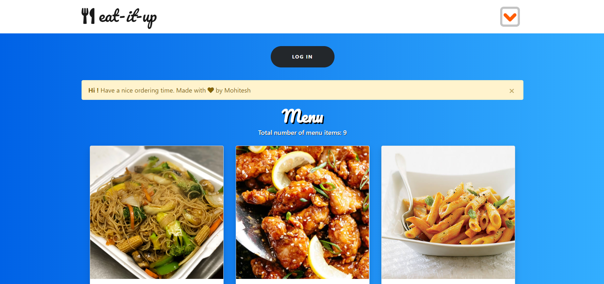
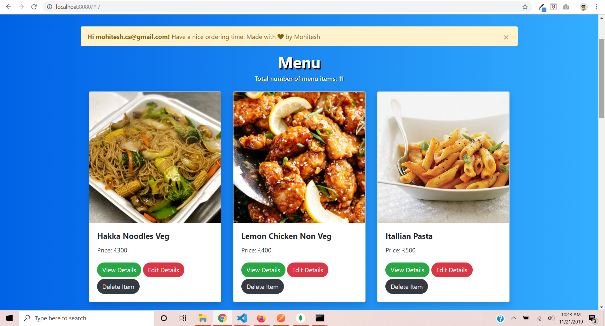
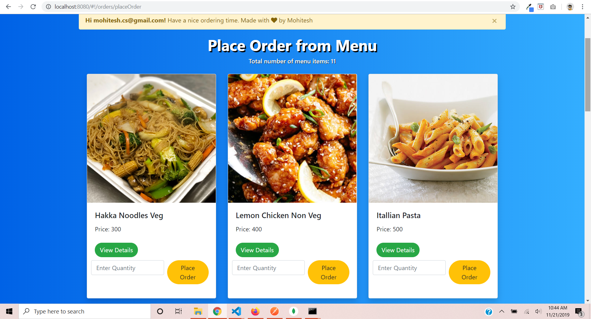

# Food Ordering Web App

Online Food Ordering App (eats) is my attempt to solve the problem of food ordering in an lucid and efficient way. This is my Software Engineering CS791 project. MVC architecture is used over here. Model is NO-SQL MongoDB, View is AngularJS, and Controller is NodeJS. The data in the front end is fetched using a RESTful API at the controller. It used JWT authentication for login.

### Usage Instructions

Make a MongoDb cluster and provide the URI String and the Password.

### Screenshots

# License

[The MIT License (MIT)](LICENSE)
